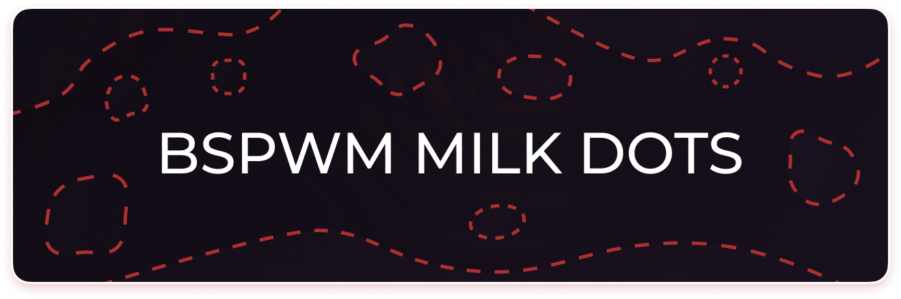
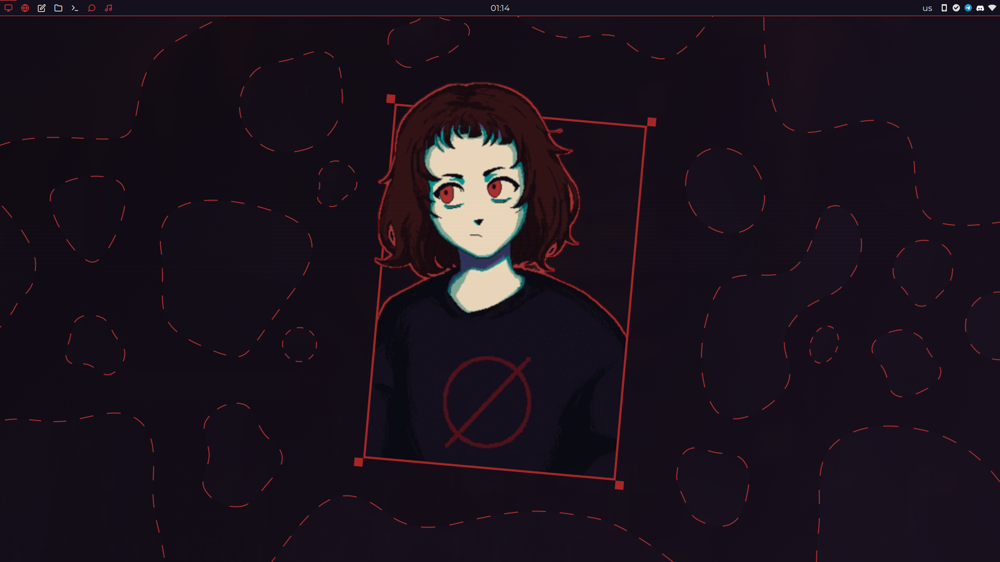
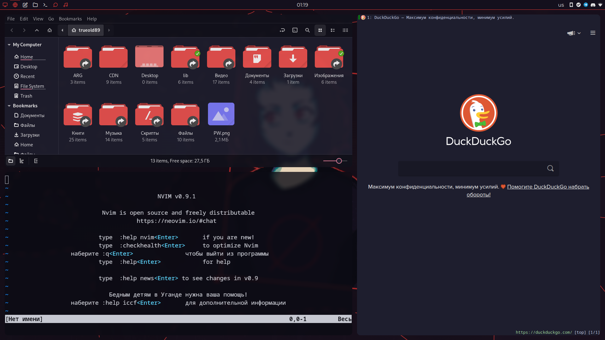
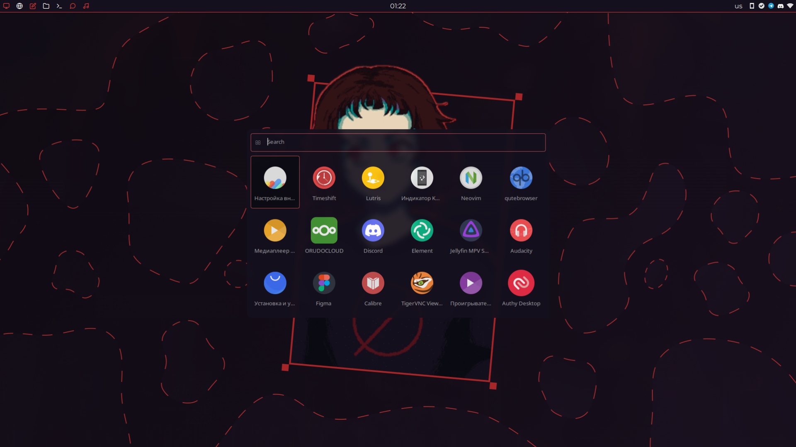
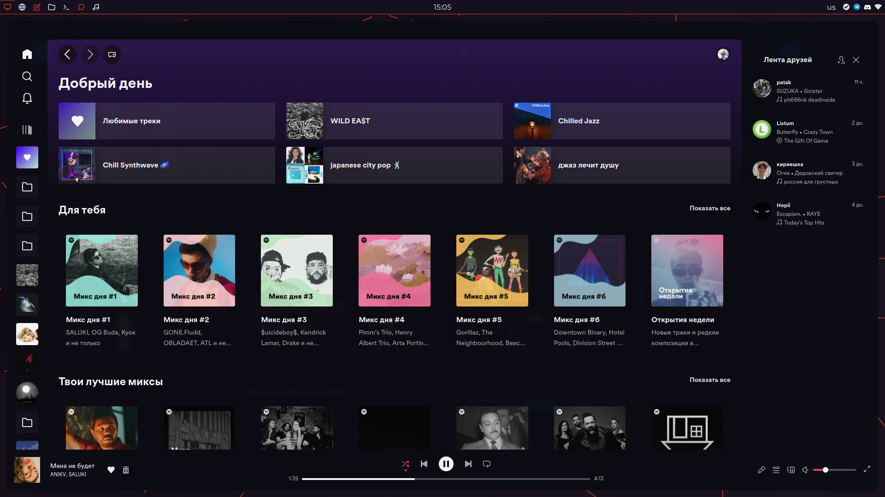
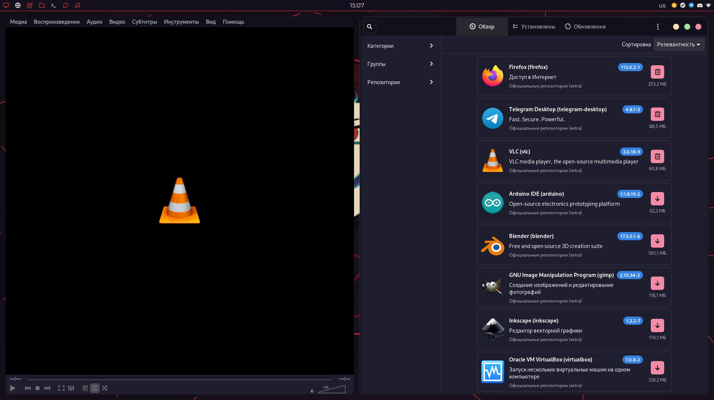
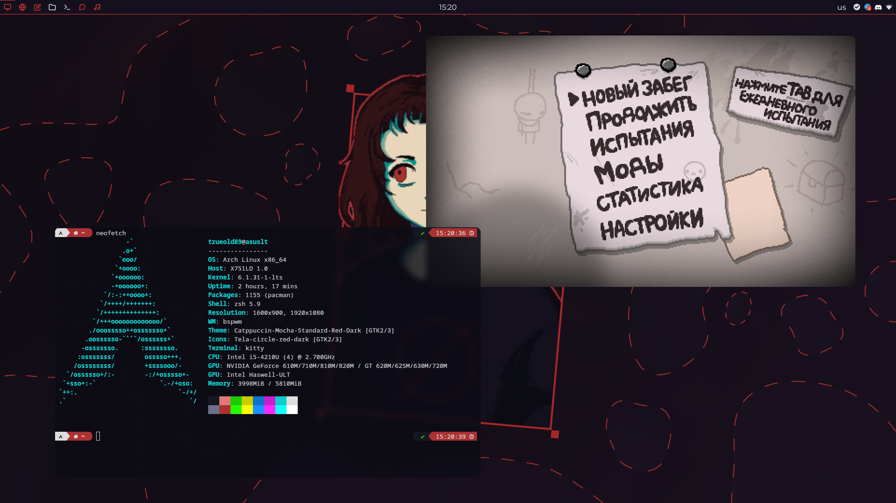

# 🥛 BSPWM MILK DOTS 🥛

## 📦 Packages:

- **🪟 BSPWM**
- **⌨️  SXHKD**
- **📜 Rofi**
- **📅 Polybar**
- **🗔  Kitty**
- **🌐 Qutebrowser**
- **🐢 ZSH**
- **🎵 Spicetify**
- **✨ Picom**

##### 🎨 GTK Theme: ["Catppuccin Mocha"](https://github.com/catppuccin/gtk)

## 🖼️ Screenshots:

## 🔗 Useful Links:
##### [Install DuckDuckGo "Catppuccin Mocha" theme](https://github.com/catppuccin/duckduckgo)
##### [Firefox "Catppuccin Mocha Red" theme](https://addons.mozilla.org/en-US/firefox/addon/catppuccin-mocha-red/)
##### [Figma wallpaper file](https://www.figma.com/community/file/1247168171405568824)

## 💚 Sources:

##### [Catppuccin](https://github.com/catppuccin/catppuccin)
##### Rofi Kanagawa *(i can't find link :с)*
##### [Polybar docky](https://github.com/adi1090x/polybar-themes#docky)

## 🔗 Other Links:
##### [GitHub Repo](https://github.com/Trueold89/BSPWM-Milk-Dots)
##### [GitLab Repo](https://gitlab.com/Trueold89/bspwm-milk-dots)
##### [Telegram channel](https://oldovtrashbin.t.me/)
##### [Discord server](https://orudo.ru)
##### [Reddit r/bspwm post](https://www.reddit.com/r/bspwm/comments/13zrxbz/bspwm_polybar_milk_outside_a_bag_of_milk_outside/?utm_source=share&utm_medium=web2x&context=3)
